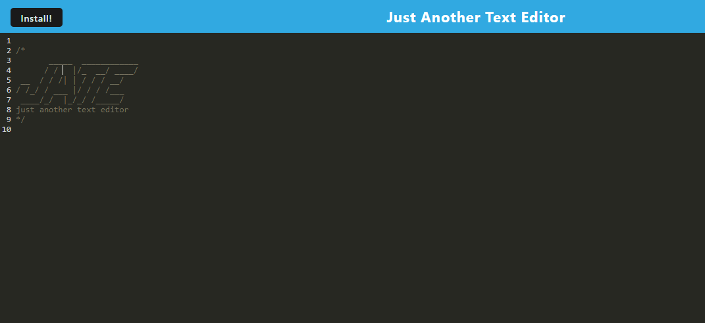

#### Table of Contents

[User Story](#user-story)
[Motivation](#motivation)
[Uniqueness](#uniqueness)
[Preview Photo](#preview-photo)
[Usage](#usage)
[Git Hub URL](#git-hub-URL)
[Author](#author)
[Email](#email)
[License](#license)
[Badge](#badge)
## [Text Editor Pro

This is a text editor that will save your information within the web browser using the browsers casche.  

## User Story

You will be able to save important text and edit text with this editor. You can also save it to your desktop.

## Motivation

This will be useful for those that need a simple way to be able to proofread text. Especially for those that do not have Word.

## Uniqueness

Its not.

## Preview Photo

## Usage

They can use it to save text.

## Git Hub URL

https://github.com/joshjankowski

## Author

Josh Jankowski

## Email

[mailto](mailto:joshjankowski@gmail.com)

## License

This project is protected by the ISC license. Copyright J Cubed LLC

## Badge

